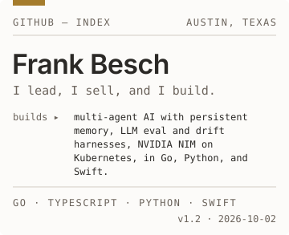
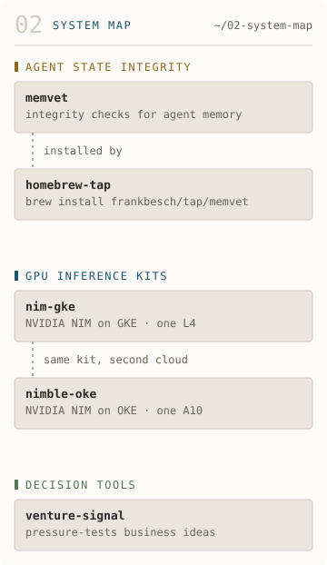
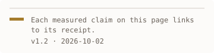

<picture><source media="(prefers-color-scheme: dark)" srcset="assets/dark/header.svg"/></picture>

[LinkedIn](https://www.linkedin.com/in/frankbesch/) · [Substack](https://frankbesch.substack.com) · [memvet](https://github.com/frankbesch/memvet) · [nim-gke](https://github.com/frankbesch/nim-gke) · [nimble-oke](https://github.com/frankbesch/nimble-oke) · [venture-signal](https://github.com/frankbesch/venture-signal)

<picture><source media="(prefers-color-scheme: dark)" srcset="assets/dark/whoami.svg"/></picture>

<picture><source media="(prefers-color-scheme: dark)" srcset="assets/dark/system-map.svg"/></picture>

Agent state integrity: [memvet](https://github.com/frankbesch/memvet), installed by [homebrew-tap](https://github.com/frankbesch/homebrew-tap). GPU inference kits: [nim-gke](https://github.com/frankbesch/nim-gke) and [nimble-oke](https://github.com/frankbesch/nimble-oke). Decision tools: [venture-signal](https://github.com/frankbesch/venture-signal).

<picture><source media="(prefers-color-scheme: dark)" srcset="assets/dark/projects.svg"/></picture>

- [memvet](https://github.com/frankbesch/memvet): `go vet` for file-based AI agent state. Latest release: [v0.12.0](https://github.com/frankbesch/memvet/releases/tag/v0.12.0).
- [venture-signal](https://github.com/frankbesch/venture-signal): a local-first decision lab that keeps attractiveness separate from evidence strength.
- [nim-gke](https://github.com/frankbesch/nim-gke): NVIDIA NIM on Google Kubernetes Engine. GPU node autoscaling 0→1→0 on one L4, measured once: [receipt](https://github.com/frankbesch/nim-gke/blob/main/docs/runs/2026-09-28-run-3-autoscale.md), [every attempt and posted cost](https://github.com/frankbesch/nim-gke/blob/main/docs/runs/README.md).
- [nimble-oke](https://github.com/frankbesch/nimble-oke): NVIDIA NIM on Oracle Kubernetes Engine. GPU node autoscaling 0→1→0 on one A10, measured once: [receipt](https://github.com/frankbesch/nimble-oke/blob/main/docs/runs/2026-10-01-run-2-autoscale.md), [every attempt and posted cost](https://github.com/frankbesch/nimble-oke/blob/main/docs/runs/README.md).

<picture><source media="(prefers-color-scheme: dark)" srcset="assets/dark/stack.svg"/></picture>

<picture><source media="(prefers-color-scheme: dark)" srcset="assets/dark/footer.svg"/></picture>
