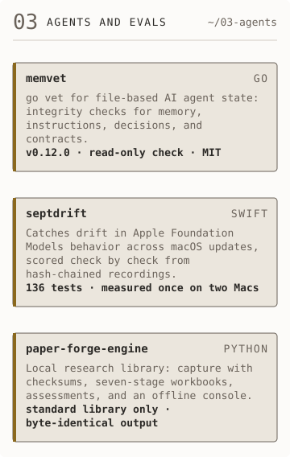
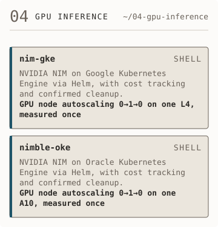
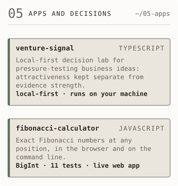

<picture><source media="(prefers-color-scheme: dark)" srcset="assets/dark/header.svg"/></picture> <picture><source media="(prefers-color-scheme: dark)" srcset="assets/dark/whoami.svg"/></picture>

[LinkedIn](https://www.linkedin.com/in/frankbesch/) · [Substack](https://frankbesch.substack.com)

Who I am, as text

I lead, I sell, and I build. Recent hands-on work includes multi-agent AI
systems with persistent memory, LLM evaluation and drift-testing harnesses,
and governed demo pipelines, written in Go, Python, and Swift, plus NVIDIA NIM
deployed on Kubernetes. In a pursuit, that lets me shape the solution with the
delivery team and pressure-test it before an operator's CIO does. I decide
where model judgment ends and deterministic code takes over, then back it with
paired evals and a cost model before the client commits.

<picture><source media="(prefers-color-scheme: dark)" srcset="assets/dark/system-map.svg"/></picture> <picture><source media="(prefers-color-scheme: dark)" srcset="assets/dark/agents.svg"/></picture>

The system map has three groups, one per project panel. Agents and evals:
[memvet](https://github.com/frankbesch/memvet), installed by
[homebrew-tap](https://github.com/frankbesch/homebrew-tap);
[septdrift](https://github.com/frankbesch/septdrift);
[paper-forge-engine](https://github.com/frankbesch/paper-forge-engine). GPU
inference: nim-gke and nimble-oke, the same NVIDIA NIM kit on two clouds.
Apps and decisions: venture-signal and fibonacci-calculator.

- [memvet](https://github.com/frankbesch/memvet): `go vet` for file-based AI agent state. Latest release: [v0.12.0](https://github.com/frankbesch/memvet/releases/tag/v0.12.0).
- [septdrift](https://github.com/frankbesch/septdrift): catches drift in Apple Foundation Models behavior across macOS updates. 136 tests; measured once on two Macs: [receipt](https://github.com/frankbesch/septdrift/blob/main/docs/runs/2026-09-30-m4-vs-m1.txt).
- [paper-forge-engine](https://github.com/frankbesch/paper-forge-engine): a local research library with an offline console, Python standard library only. The same inputs give byte-identical output: [golden hash](https://github.com/frankbesch/paper-forge-engine/blob/main/tests/golden/library.sha256).

<picture><source media="(prefers-color-scheme: dark)" srcset="assets/dark/gpu-inference.svg"/></picture> <picture><source media="(prefers-color-scheme: dark)" srcset="assets/dark/apps.svg"/></picture>

- [nim-gke](https://github.com/frankbesch/nim-gke): NVIDIA NIM on Google Kubernetes Engine. GPU node autoscaling 0→1→0 on one L4, measured once: [receipt](https://github.com/frankbesch/nim-gke/blob/main/docs/runs/2026-09-28-run-3-autoscale.md), [every attempt and posted cost](https://github.com/frankbesch/nim-gke/blob/main/docs/runs/README.md).
- [nimble-oke](https://github.com/frankbesch/nimble-oke): NVIDIA NIM on Oracle Kubernetes Engine. GPU node autoscaling 0→1→0 on one A10, measured once: [receipt](https://github.com/frankbesch/nimble-oke/blob/main/docs/runs/2026-10-01-run-2-autoscale.md), [every attempt and posted cost](https://github.com/frankbesch/nimble-oke/blob/main/docs/runs/README.md).
- [venture-signal](https://github.com/frankbesch/venture-signal): a local-first decision lab that keeps attractiveness separate from evidence strength.
- [fibonacci-calculator](https://github.com/frankbesch/fibonacci-calculator): exact Fibonacci numbers as BigInt, in the browser and on the command line; 11 tests. [Live app](https://frankbesch.github.io/fibonacci-calculator/), [timing receipt](https://github.com/frankbesch/fibonacci-calculator/blob/main/docs/runs/2026-10-03-methods.txt).
- Stack: Go, TypeScript, Python, Swift; NVIDIA NIM, Helm, Kubernetes on GKE and OKE; paired evals, cost models, and run receipts.

Each measured claim on this page links to its receipt. Panels v1.6, 2026-10-03.
